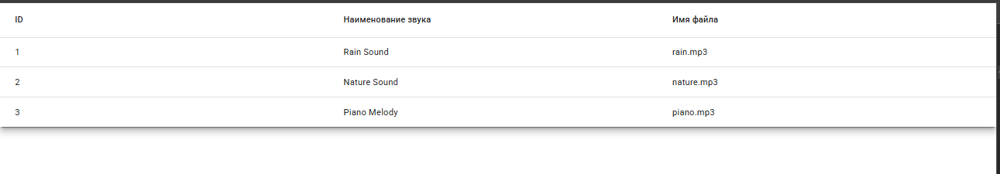

# 🎵 Sound Player App (Angular 15)

Одностраничное Angular-приложение, отображающее список MP3-записей в виде таблицы (Material Table). При выборе строки под таблицей появляется плеер для прослушивания выбранного звука.

## 🛠 Технологии

- Angular 15
- Angular Material (`mat-table`, `mat-card`)
- SCSS
- HTML5 `<audio>`

## 📸 Скриншот



## 🔧 Функциональность

- Отображение таблицы с колонками:
  - ID
  - Название звука
  - Имя файла
- Клик по строке активирует плеер под таблицей
- Плеер воспроизводит `.mp3` файл из публичного источника
- Подсветка выбранной строки (дополнительно)
- Поддержка адаптивности (дополнительно)

## ▶️ Запуск локально

```bash
git clone https://github.com/Nazarov99/sound-player.git
cd sound-player
npm install
ng serve
